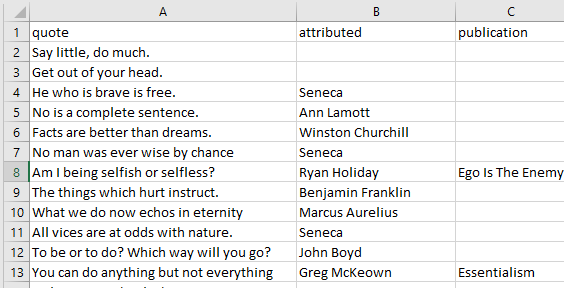
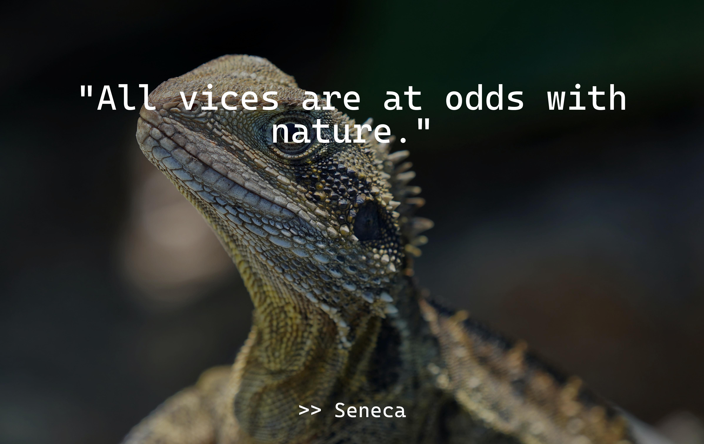
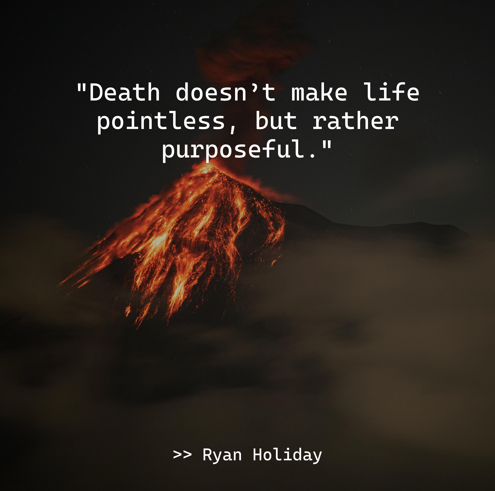
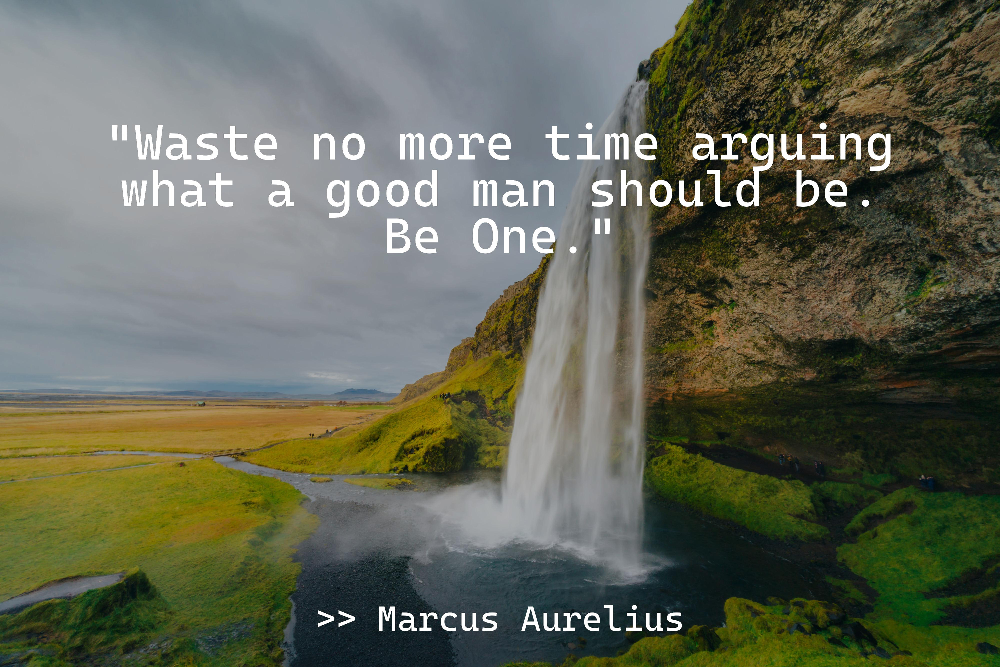

# Summary
This project allows you to create inspirational quote/images from freely available stock image site "unsplash" or whatever images you want, really. I used this to fill an old digital photo frame with rotating quotes. See the [Examples](#examples) below.

# Getting Started
1. Install dependencies from requirements.txt
    - `pip install -r requirements.txt`

2. Create a list of quotes - in /data/raw/quotes.csv (a demo file is provided)
    - Should have two columns: "quote" and "attributed".
    - 

3. Create an account on Unsplash and get ClientID
    - If you already have images, you can skip this part - just load your images into /data/raw/images
    - Go to: [Unsplash Developers](https://unsplash.com/developers)
    - Sign up
    - Under "Your Apps", create an app and get ClientID (aka: "Access Key")
    - Create a .env file in the root of the project.
    - Create an env variable: `UNSPLASH_CLIENTID=c238cg3ge9g9e_cedusgidicdsc929g29g2972e32df` (this is not a valid client id)
    - Note: There are two levels of app:
        - Dev: Allows 50 calls per hour (plenty for this project - to get up to 1500 images from a topic to work with)
        - Prod: Allows 50,000 calls per hour... obviously, this is probably excessive.

4. Create nature images - to be the base of your inspirational messages.
    - Run /src/data/unsplash
    - in the main() method, `us.getRandomImagesForTopic("nature", 150, 30)`
        - "nature" is the topic - you can pick a different topic if you'd like (explore unsplash.com)
        - count (int): The number of images to return/save. 150 in the example. 
        - pages (int): The number of pages to get from Unsplash. Be aware of your API limits. 30 in the example for (900 total images), and it'll sample out 150 randomly.
        - wideOnly (bool, optional): Whether you only want to return wide aspect images. Defaults to True.
        - saveFiles (bool, optional): Whether you want to save the files to /data/raw/images. Defaults to True.
    - in the getRandomImagesForTopic() method:
        - `PADDING=0.1`: The amount of padding for the quote and author boxes (0.1 = 10% of the width and height of the image)
        - `BOX_COLOR=(0,0,0)`: The color for the background box in RGB. 0,0,0 is black... 255,255,255 is white. 
        - `OPACITY=50`: The opacity (aka: alpha) - from 0 to 255, 0 is transparent, 255 is solid. 

5. Create the inspirational images
    - Run /src/data/imagemaker
    - Will combine the quotes and images, making inspirational images, like below. 
    - Saves files in /data/processed/images

6. Use them!
    - I uploaded mine to a digital photo frame and they rotate throughout the day!
 

## Examples:

## Notes
- The code doesn't currently consider the image size - the "normal" image size in Unsplash apparently isn't standardized. So, while text is adjusted for the length of a quote, it may appear smaller or larger depending on the resolution of the image. 